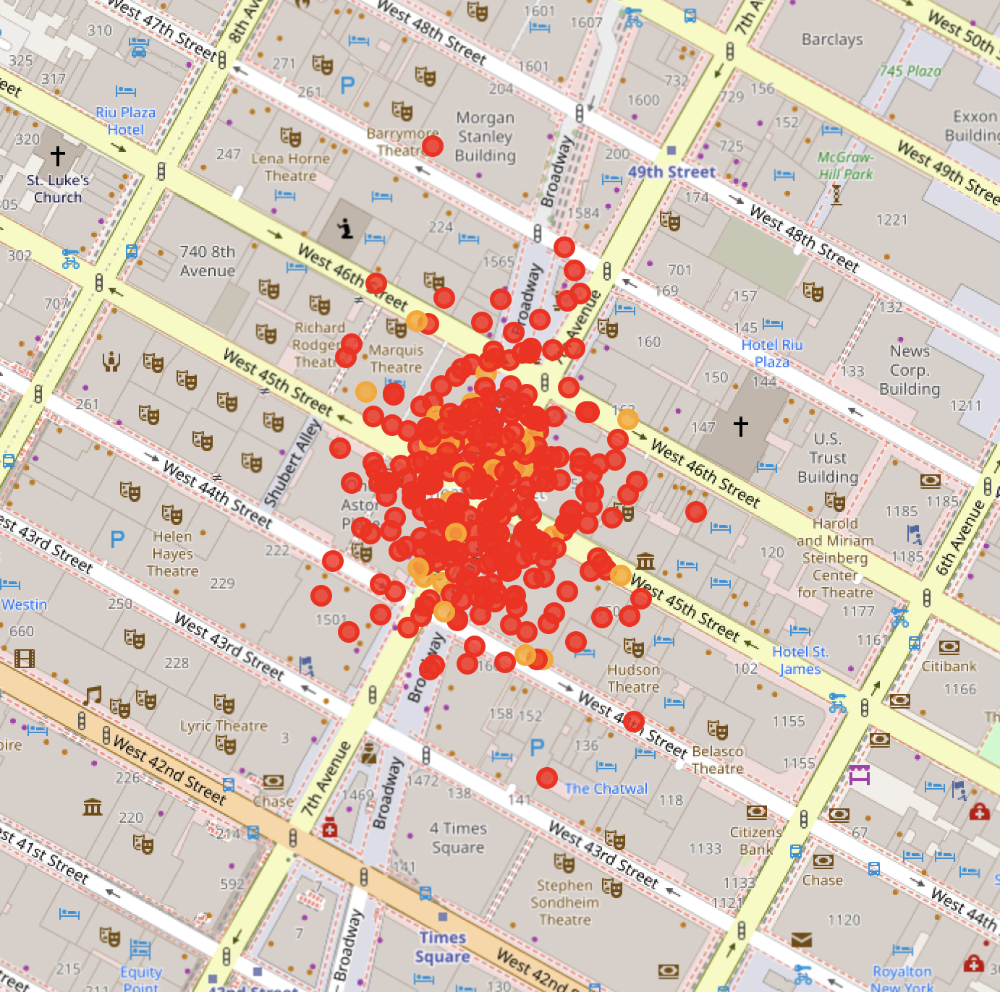

# Real-Time Traffic Congestion Detection 🚗📊

> Lightweight and modular project simulating smart city congestion monitoring using computer vision and geospatial ML. Ideal for resumes and interviews.

<p align="center">
  
</p>

---

## 🧠 Key Features

* **Vehicle Detection**: Simulated video frames analyzed using YOLOv5 and OpenCV to count vehicles at the frame level.
* **Congestion Index**: Dynamic congestion score computed using vehicle counts and mock GIS coordinates.
* **Pattern Prediction**: LightGBM classifier trained on spatiotemporal features to classify congestion levels (Light / Moderate / Heavy).
* **Interactive Map**: Folium dashboard with congestion heatmaps for visual analysis.
* **(Optional)** Edge Optimization Ready: Model structure supports conversion to ONNX for future Raspberry Pi / Jetson Nano deployment.

---

## 🗂️ Project Structure

traffic-congestion-detection/
├── README.md
├── data/
│ ├── vehicle_counts.csv
│ └── gps_labels.csv
├── demo/
│ └── folium_map.html
├── notebooks/
│ └── model_training.ipynb
├── src/
│ ├── yolo_detection.py
│ ├── congestion_index.py
│ ├── train_model.py
│ └── visualize.py
├── .venv/
├── requirements.txt


---

## 🚀 How to Run

```bash
# Clone the repo
git clone https://github.com/yourusername/traffic-congestion-detection.git
cd traffic-congestion-detection

# Set up virtual environment (optional but recommended)
python -m venv .venv
source .venv/bin/activate  # On Windows use `.venv\Scripts\activate`

# Install dependencies
pip install -r requirements.txt

# Run the full pipeline
python src/yolo_detection.py          # Detect vehicles (simulated)
python src/congestion_index.py       # Generate congestion scores
python src/train_model.py            # Train LightGBM model
python src/visualize.py              # Generate folium heatmap

Output map will be saved to: demo/folium_map.html

🛠 Tech Stack

Languages: Python
CV & Detection: OpenCV, YOLOv5
Modeling: LightGBM
Visualization: Folium, Pandas
Deployment-ready: ONNX (future work), Streamlit (optional)
📍 Use Case

This end-to-end machine learning project simulates a real-time traffic congestion detection system, combining object detection, spatiotemporal classification, and interactive geospatial visualization. It’s perfect for showcasing smart city infrastructure applications, ML system design, and portfolio-ready technical depth.

✅ To-Do

Add Streamlit dashboard for interactive inference
Convert YOLOv5 model to ONNX and test on Jetson Nano
Integrate NYC DOT or open traffic camera APIs for real-time input
👩‍💻 Author

Jiangnan Wan · MS in Statistics @ Columbia University
💼 LinkedIn
📂 GitHub
📬 Contact: jiangnanwan2002@gmail.com